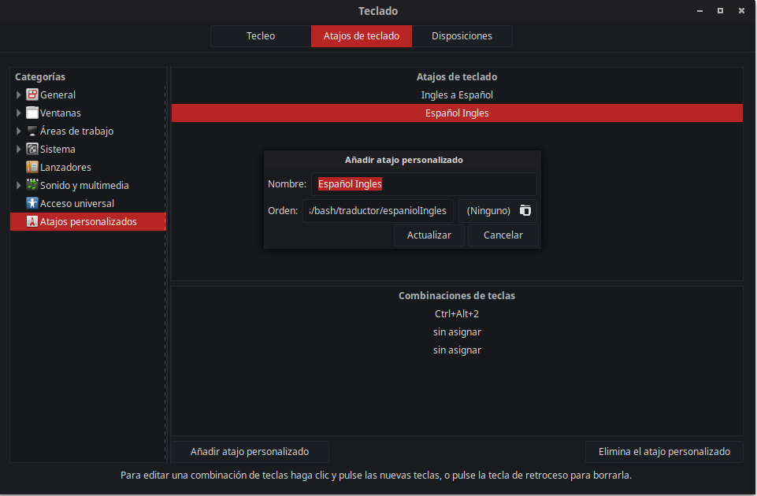
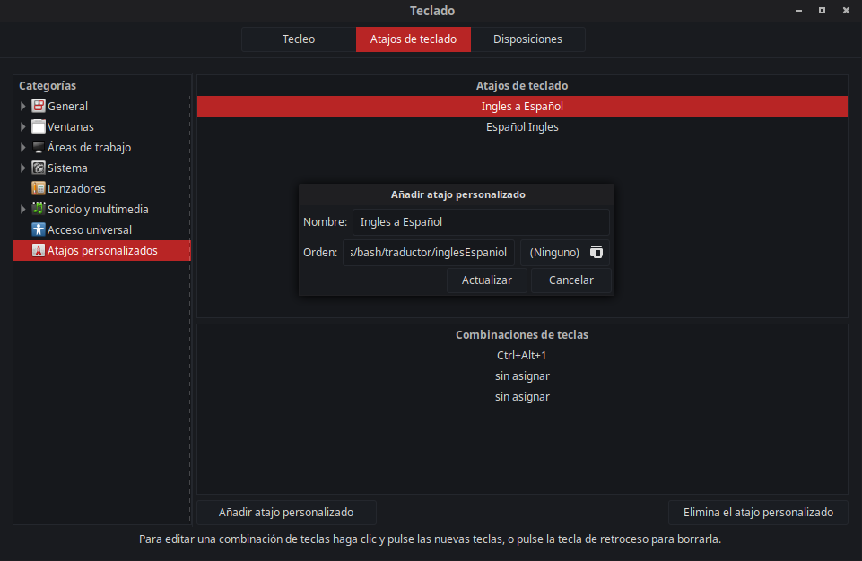
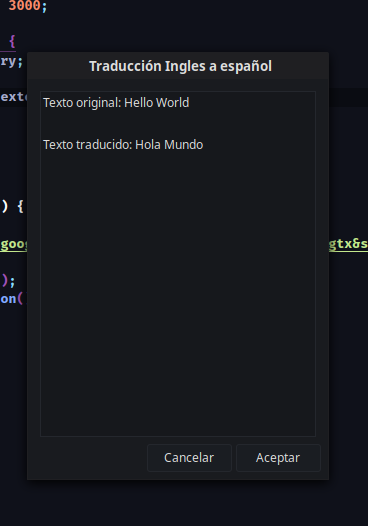
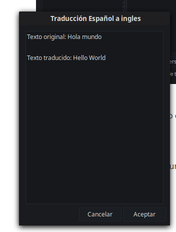

### Para traducir texto del portapapeles

Ubica los archivos espaniolIngles y inglesEspaniol donde guste en tu computador, luego crea un atajo de teclado teclado que apunte a cada uno de estos archivos.

Por ejemplo

Luego de esto al seleccionar un texto en ingles y copiarlo (Ctrl + c) y luego pulsar Ctrl+Alt+1 aparecerá algo como

Y en el caso contrario al seleccionar un texto en español y copiarlo (Ctrl + c) y luego pulsar Ctrl+Alt+2 aparecerá algo como (ademas quedará copiado en el portapapeles)

En caso de no funcionar instalar 

`sudo apt-get install -y zenity`

`sudo apt-get install -y xsel`